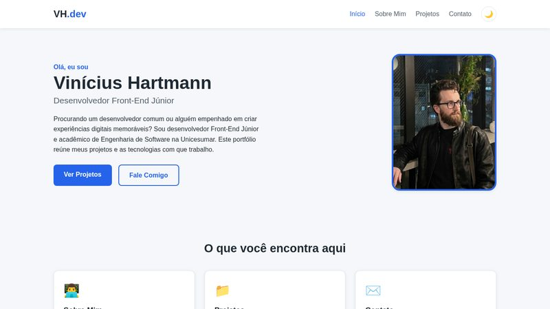

# Portfólio Pessoal — Vinícius Hartmann

Portfólio pessoal responsivo desenvolvido com **HTML5, CSS3 e JavaScript puro**, sem frameworks.

🔗 **Acesse o site:** https://vhartmann11.github.io/portfolio/



## 📄 Páginas

- **Início** (`index.html`) — apresentação e destaques
- **Sobre Mim** (`sobre.html`) — formação e habilidades
- **Projetos** (`projetos.html`) — meus projetos com links para os repositórios
- **Contato** (`contato.html`) — formulário com validação em JavaScript

## ⚙️ Funcionalidades

- Layout responsivo (media queries em 768px e 480px, Flexbox e CSS Grid)
- Menu de navegação com botão hambúrguer no mobile
- Modo claro/escuro com preferência salva no `localStorage`
- Botão "voltar ao topo" que aparece ao rolar a página
- Formulário de contato com validação completa em JavaScript (campos obrigatórios, formato de e-mail e mensagens de erro por campo)
- SEO básico: HTML semântico, `title` e `meta description` únicos por página e `alt` nas imagens

## 📁 Estrutura

```
├── index.html
├── sobre.html
├── projetos.html
├── contato.html
├── css/
│   └── style.css
├── js/
│   └── script.js
└── img/
```

## 🚀 Como executar localmente

Não há dependências — basta clonar e abrir no navegador:

```bash
git clone https://github.com/vhartmann11/portfolio.git
cd portfolio
```

Abra o `index.html` no navegador (ou use um servidor local, como a extensão Live Server do VS Code).

## 🎓 Contexto

Projeto desenvolvido como atividade MAPA da disciplina de **Programação Front-End** do curso de Engenharia de Software (Unicesumar).

---

Feito por [Vinícius Hartmann](https://github.com/vhartmann11) · [LinkedIn](https://www.linkedin.com/in/vhartmann11/)
